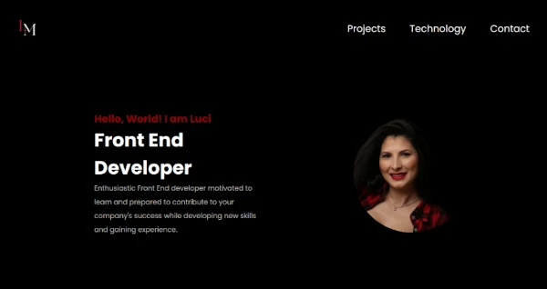

# Personal Web Page

This is my web page to show my projects and my coding skills building projects. 

## Table of contents

- [Overview](#overview)
  - [The challenge](#the-challenge)
  - [Screenshot](#screenshot)
  - [Links](#links)
- [My process](#my-process)
  - [Built with](#built-with)
  - [What I learned](#what-i-learned)
  - [Continued development](#continued-development)
- [Author](#author)

## Overview
 Static web page for my portfolio.

### The challenge

Users should be able to:

- View the optimal layout for the site depending on their device's screen size.
- See hover states for all interactive elements on the page.

### Screenshot

### Links

- Solution URL: [Source code](https://github.com/LuciMacedo/LuciWebPage.github.io)
- Live Site URL: [URL here](https://luci-webpage.vercel.app/)

### Built with

- Semantic HTML5 markup
- Flexbox
- [React](https://reactjs.org/) - JS library
- [Styled Components](https://styled-components.com/) For styles

### What I learned
While working through this project I could practice Router. I am proud that I have built this application from scratch for my portfolio without any tutorial.

### Continued development

Areas that I want to continue focusing on in future projects are JavaScript and React.  

## Author

- Website - [Luci](https://luci-webpage.vercel.app/)
- LinkedIn - [@lucimacedo](linkedin.com/in/lucimaramacedom)
